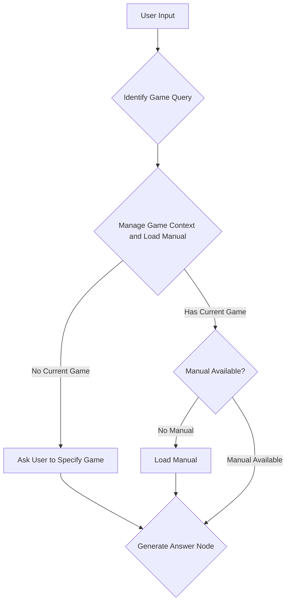

# Board Game Rules Assistant
Board game rules can often be complex and challenging to understand. 
This repository was created to explore the use of language models in tandem with board game rule books to 
simplify the process of answering questions about game rules.

Board games are a fantastic source of fun and camaraderie, however, the perceived complexity of many games can be
a barrier to entry. This was created due to the frustration I encountered when reading the spirit island manual. The
manual is well-written, but not well-structured (in my opinion).  To the manufacturer's credit, there is a lot to 
explain about this game.  After many frustrating moments of flipping frantically through the manual to make sure I was
 following a nuanced rule correctly, I decided to explore alternatives via LLMs.

## Gemini

Why not OpenAI? Why not `GPT-4` or `GPT-4 Turbo`?

The key differentiator lies in context window capacity. Gemini offers an impressive 1.02 million token context window,
substantially larger than OpenAI's more accessible models capped at 200,000 tokens. Additionally, Gemini Flash currently
provides 1000 free daily requests - making it an ideal platform for exploration and research.

This project explores how large context windows handle complex information like board game rules. There's ongoing
discussion about whether Gemini's larger context window (which can process entire documents multiple times in one
conversation) could reduce the need for traditional retrieval-augmented generation (RAG). While that remains to be seen,
this implementation provides practical insights.

Traditional RAG systems are built on the assumption that the retrieval process will retrieve the most relevant text for a query.
But as content grows, this approach can struggle, especially with board game rules where concepts are deeply interconnected. 
Game mechanics often depend on multiple rules working together, which makes it hard for normal search methods to find 
the relevant pieces.

By using Gemini's expanded context window to look at entire rulebooks at once, we can avoid these retrieval challenges
and enable more comprehensive answers about game rules.  Many of these manuals are 20+ pages long, with some reaching
up to 100+ pages.  While a traditional RAG system with one question and one answer wouldn't require such a long
context window, agentic systems with chat memory will as all system prompts, user messages, and assistant messages
are passed to the LLM at every call.

## The agent
This agent is designed to act as an intelligent assistant for board game enthusiasts, 
specializing in answering questions based on game rulebooks. At its core, it leverages the power of Gemini to understand 
user queries both extract and interpret relevant information from provided game manuals. 

The structure is a state-based agent using LangGraph, which allows it to maintain context across multiple user interactions.
The agent operates in a series of steps, which are outlined below:


## How to Run
1.  **Set up Environment:**
    *   Create a file named `.env` in the root directory of this project.
    *   Inside the `.env` file, add your Gemini API key like this:
        ```
        GEMINI_API_KEY=your_api_key_here
        ```
2.  **Create Manuals Directory:**
    *   Create a directory named `text` in the root directory of this project. This is where the agent will look for game manuals.
3.  **Add Game Manuals:**
    *   Place the pdf files (`.pdf`) of the board game manuals you want to use into the `pdf` directory.
    *   Execute `Extract_Raw_Text_From_PDF_Files.py](Extract_Raw_Text_From_PDF_Files.py` for each file
    *   The agent currently is configured to look for games like "spirit_island" and "wingspan" as defined in `POSSIBLE_BOARD_GAMES` in `board_game_agent.py`. You may need to update this list if you add other games.
4.  **Run the Streamlit App:**
    *   Open your terminal or command prompt.
    *   Navigate to the root directory of this project.
    *   Run the app using the following command:
        ```bash
        streamlit run app.py
        ```
5.  **Interact with the App:**
    *   Your web browser should open automatically with the Streamlit app running.
    *   Enter your questions about board game rules in the text input field.
    *   To specify a game, mention its name in your initial message.